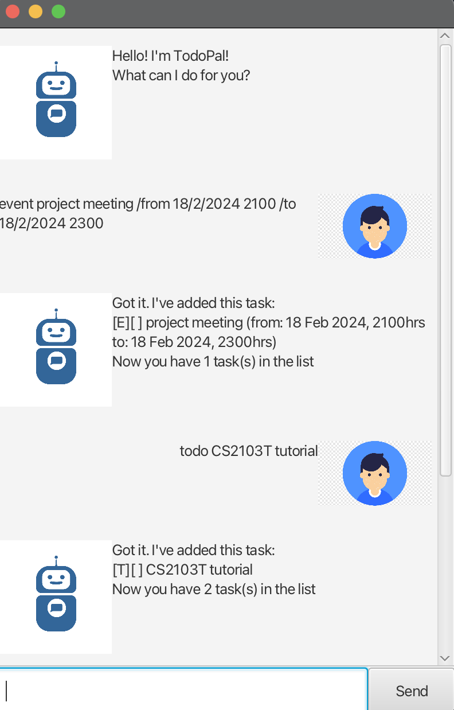

# TodoPal User Guide

Welcome to TodoPal! TodoPal is a **desktop app for managing tasks** optimized for use via a Command Line Interface (CLI) while still having the benefits of a Graphical User Interface (GUI). TodoPal will help you be more organised and track your progress on your tasks. Type in a command to get started!



## Quick start

1. Ensure you have `Java 11` or above installed in your Computer.
2. Download the latest `TodoPal.jar` from [here](https://github.com/bertrandong/ip/releases).
3. Copy the file to the folder you want to use as the home folder for your TodoPal.
4. Open a command terminal, `cd` into the folder you put the jar file in, and use the `java -jar TodoPal.jar` command to run the application.
5. Begin typing a command in the command box and press Enter to execute it!

## Features
> [!NOTE]
> 
> Words in UPPER_CASE are the parameters to be supplied by the user.
> e.g. in `todo TASK_DESCRIPTION`, `TASK_DESCRIPTION` is a parameter which can be used as `todo CS2103T tutorial`.
> 
> TodoPal does not accept **duplicate tasks**!


### Adding a Todo: `todo`

Adds a todo to the to-do list.

Format: `todo TASK_DESCRIPTION`

Example: `todo CS2103T tutorial`

Here, the todo task 'CS2103T tutorial' is added to the to-do list.

```
Got it. I've added this task:
[T][ ] CS2103T tutorial
Now you have 1 task(s) in the list
```


### Adding a deadline: `deadline`

Adds a deadline to the to-do list.

Format: `deadline TASK_DESCRIPTION /by DD/MM/YYYY HHMM`

Example: `deadline CS2103T assignment /by 1/4/2024 2359`

Here, the deadline task 'CS2103T assignment' is added to the to-do list, with a deadline set at 1 Apr 2024 2359hrs.

```
Got it. I've added this task:
[D][ ] CS2103T assignment (by: 01 Apr 2024, 2359hrs)
Now you have 2 task(s) in the list
```

### Adding an event: `event`

Adds an event to the to-do list.

Format: `event TASK_DESCRIPTION /from DD/MM/YYYY HHMM /to DD/MM/YYYY HHMM`

Example: `event Project meeting /from 22/2/2024 2100 / to 22/2/2024 2300`

Here, the event task 'Project meeting' is added to the to-do list, with a start time of 2 Feb 2024 2100hrs and an end time of 2 Feb 2024 2300hrs.

```
Got it. I've added this task:
[E][ ] Project meeting (from: 22 Feb 2024, 2100hrs to: 22 Feb 2024, 2300hrs)
Now you have 3 task(s) in the list
```

### Listing out all tasks: `list`

Lists out all tasks that are currently on the task list.

Format: `list`

Example: `list`

Here, all tasks that were previously added to the task list are listed out.

```
Here are the tasks in your list
1. [T][ ] CS2103T tutorial
2. [D][ ] CS2103T assignment (by: 01 Apr 2024, 2359hrs)
3. [E][ ] Project meeting (from: 22 Feb 2024, 2100hrs to: 22 Feb 2024, 2300hrs)
```

### Marking a task: `mark`

Marks an unmarked task on the to-do list as done.

Format: `mark TASK_INDEX`

Example: `mark 1`

Here, the task with the task index of '1' will be marked as done.

```
Nice! I've marked this task as done:
[T][X] CS2103T tutorial
Now you have 3 task(s) in the list
```

### Marking a task: `unmark`

Unmarks a marked task on the to-do list as undone.

Format: `unmark TASK_INDEX`

Example: `unmark 1`

Here, the task with the task index of '1' will be marked as undone.

```
Nice! I've marked this task as not done yet:
[T][ ] CS2103T tutorial
Now you have 3 task(s) in the list
```

### Finding tasks by keyword: `find`

Finds a task in the to-do list, given a specific keyword.

Format: `find KEYWORD`

Example: `find CS2103T`

Here, all tasks in the task list with 'CS2103T' will be filtered out and returned to the user.

```
Here are the matching tasks in your list:
1. [T][ ] CS2103T tutorial
2. [D][ ] CS2103T assignment (by: 01 Apr 2024, 2359hrs)
```

### Deleting a task: `delete`

Deletes the specified task on the to-do list.

Format: `delete TASK_INDEX`

Example: `delete 2`

Here, the task with the task index of '2' will be deleted.

```
Noted. I've removed this task:
[D][ ] CS2103T assignment (by: 01 Apr 2024, 2359hrs)
Now you have 2 task(s) in the list
```

### Exiting the program: `bye`

Exits the program

Format: `bye`

### Saving the data

TodoPal data are saved in the hard disk automatically after any command that changes the data. There is no need to save manually.

### Editing the data file

TodoPal data are saved automatically as a JSON file `[JAR file location]/data/todopal.txt`. Advanced users are welcome to update data directly by editing that data file.